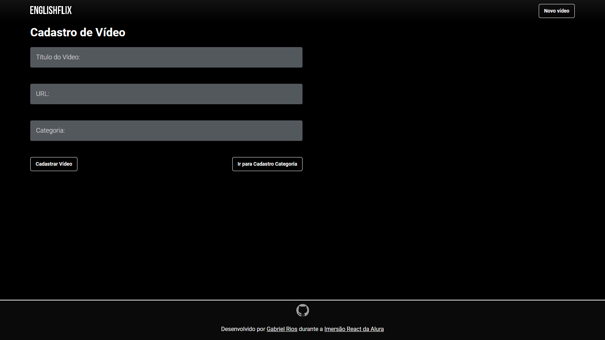
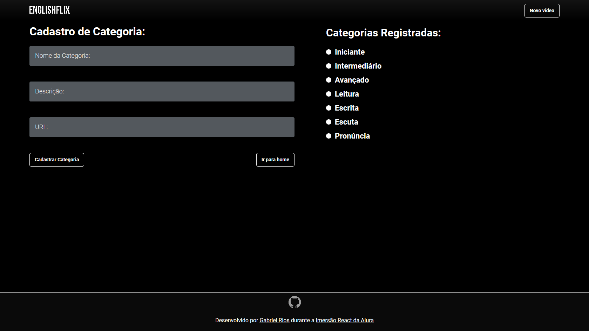

<h1 align="center" >
    
</h1>

<h3 align="center">
    📺 Sua plataforma de videos para aprender inglês
</h3>

<p align="center">
  

  

  <a href="https://github.com/grioos/README-proffy/commits/master">
    
  </a>
    
   
   <a href="https://github.com/grioos/englishflix/stargazers">
    
  </a>

</p>

<h1 align="center">
    
</h1>

<h4 align="center"> 
	🚧  Englishflix 📺 Concluído 🚀 🚧
</h4>

<p align="center">
  <a href="#-sobre-o-projeto">Sobre</a> •
  <a href="#-funcionalidades">Funcionalidades</a> •
  <a href="#-layout">Layout</a> • 
  <a href="#-como-executar-o-projeto">Como executar</a> • 
  <a href="#-tecnologias">Tecnologias</a> • 
  <a href="#-autor">Autor</a> • 
  <a href="#user-content--licença">Licença</a>
</p>


## 💻 Sobre o projeto

📺 Englishflix - É uma plataforma de vídeos inspirado na Netflix. Onde se pode adicionar vídeos que seram visualizados em um carousel, e criar categorias para fazer uma melhor separação do conteúdo.

Projeto desenvolvido durante a **Imesão React** oferecida pela [Alura](https://www.alura.com.br/).

---

## ⚙️ Funcionalidades

- [x] Vídeos podem ser cadastrados na plataforma enviando:
  - [x] um título com o nome do vídeo
  - [x] url do vídeo para demostração na home
  - [x] e a escolha de uma categoria que melhor se encaixa com o conteúdo

- [x] Categorias podem ser cadastrados na plataforma enviando:
  - [x] um nome para a categoria
  - [x] descrição com melhor explicação sobre o que se adicionar nesta categoria
  - [x] url para um site ou vídeo, servindo como um plus" para a categoria

---

## 🎨 Layout

### Cadastro de vídeo 

<p align="center" style="display: flex; align-items: flex-start; justify-content: center;">
  	
</p>

### Criar categoria

<p align="center" style="display: flex; align-items: flex-start; justify-content: center;">
	
</p>

---

## 🚀 Como executar o projeto

Antes de começar, você vai precisar ter instalado em sua máquina as seguintes ferramentas:
[Git](https://git-scm.com), [Node.js](https://nodejs.org/en/). 
Além disto ter um editor para trabalhar com o código como [VSCode](https://code.visualstudio.com/)

#### 🧭 Rodando a aplicação

```bash

# Clone este repositório
$ git clone https://github.com/grioos/englishflix

# Acesse a pasta do projeto no seu vscode
$ cd englishflix

# Instale as dependências
$ npm install

# Execute a aplicação 
$ npm run dev

# A aplicação será aberta na porta:3000 - acesse http://localhost:3000

```

---

## 🛠 Tecnologias

As seguintes ferramentas foram usadas na construção do projeto:
-   **[Concurrently](https://github.com/kimmobrunfeldt/concurrently)**
-   **[Express](https://expressjs.com/)**
-   **([NodeJS](https://nodejs.org/en/)**
-   **[JavaScript](https://www.javascript.com/))**
-   **[JSON Server](https://github.com/typicode/json-server)**
-   **[React](https://reactjs.org/)**
-   **[React Dom](https://pt-br.reactjs.org/docs/react-dom.html)**
-   **[React Icons](https://react-icons.github.io/react-icons/)**
-   **[React Router Dom](https://github.com/ReactTraining/react-router/tree/master/packages/react-router-dom)**
-   **[React Scripts](https://github.com/facebook/create-react-app/tree/master/packages/react-scripts)**
-   **[React Slick](https://github.com/akiran/react-slick)**
-   **[Prop Types](https://pt-br.reactjs.org/docs/typechecking-with-proptypes.html)**
-   **[Styled Components](https://styled-components.com/)**

> Veja o arquivo  [package.json](https://github.com/grioos/englishflix/blob/master/package.json)

---

## 💪 Como contribuir para o projeto

1. Faça um **fork** do projeto.
2. Crie uma nova branch com as suas alterações: `git checkout -b my-feature`
3. Salve as alterações e crie uma mensagem de commit contando o que você fez: `git commit -m "feature: My new feature"`
4. Envie as suas alterações: `git push origin my-feature`

---

## 🦸 Autor

 
 <br />
 <sub><b>Gabriel Rios</b></sub> 🚀
 <br />

[](https://www.linkedin.com/in/grioos/) 
[](https://www.instagram.com/grioos_/)
[](mailto:gabriel.al.rio@gmail.com)

---

## 📝 Licença

Este projeto esta sobe a licença [MIT](./LICENSE.md).

Feito por Gabriel Rios 👋🏻 [Entre em contato!](https://www.linkedin.com/in/grioos/)
